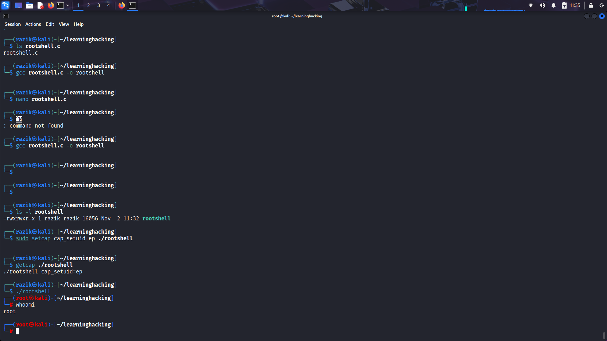

## 🔥 Day 13: File Capabilities Abuse

- ✅ Compiled `rootshell.c` to spawn a shell
- ✅ Assigned `cap_setuid+ep` using `setcap`
- ✅ Verified escalation with `whoami → root`

### 🖼️ Proof of Lab Completion

### 🔐 Mitigation
- Audit: `getcap -r / 2>/dev/null`
- Remove: `setcap -r /path/to/binary`
