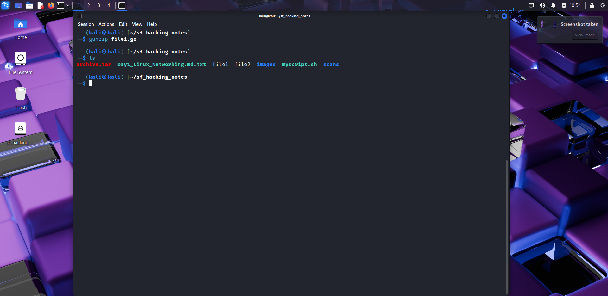
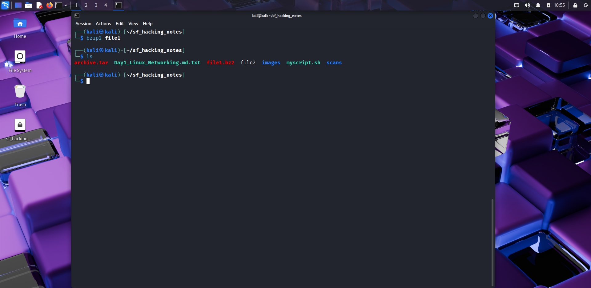
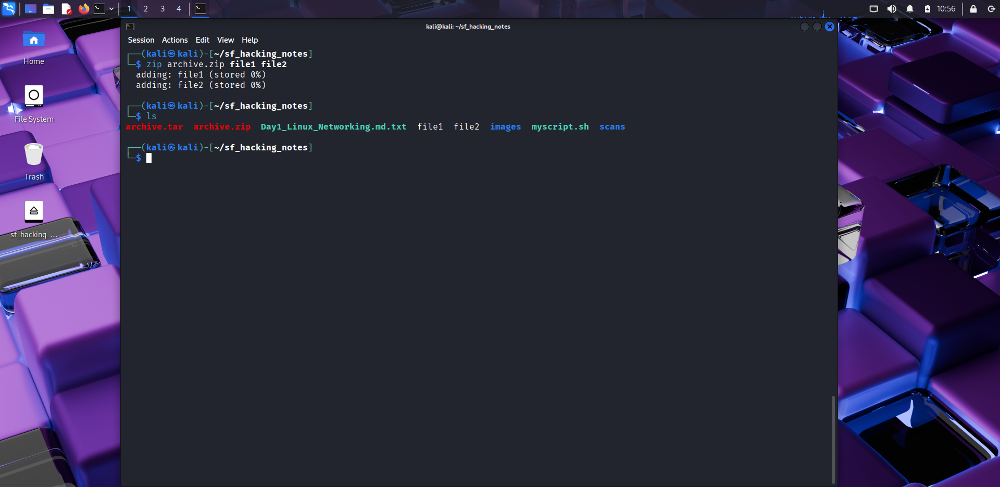
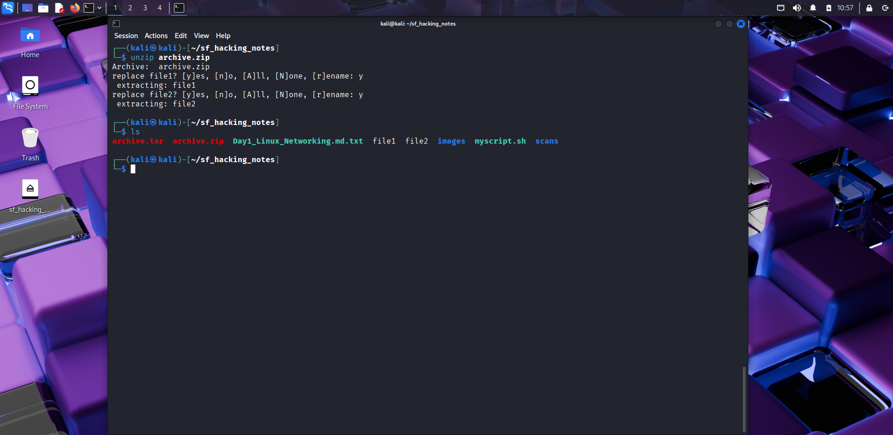

# 📦 Day 10 – Archiving & Compression

## 📅 Date: 18/09/2025  

### 🔹 Commands Learned  

#### Archiving with `tar`  
- `tar -cvf archive.tar file1 file2` → create archive  
📸   

- `tar -xvf archive.tar` → extract archive  
📸   

- `tar -tvf archive.tar` → list files in archive  
📸   

---

#### Compression  
- `gzip file1` → compress file1 → file1.gz  
📸   

- `gunzip file1.gz` → decompress  
📸   

- `bzip2 file1` → compress using bzip2  
📸   

- `bunzip2 file1.bz2` → decompress  
📸   

---

#### Working with `.zip`  
- `zip archive.zip file1 file2` → create zip file  
📸   

- `unzip archive.zip` → extract zip file  
📸   

---

### 🔹 Key Learnings  
1. **tar** = archive multiple files into one.  
2. **gzip/bzip2** = compress single files (smaller size).  
3. **zip/unzip** = widely used for compression + archiving (cross-platform).  
4. Useful for **backups, transferring tools, CTF challenges**.  

---

### 🔹 Next Steps  
Tomorrow → **Day 11: User & Group Management** (adduser, passwd, groups).  

---

### 🔖 Suggested commit message  
`Day 10 – Archiving & Compression`
