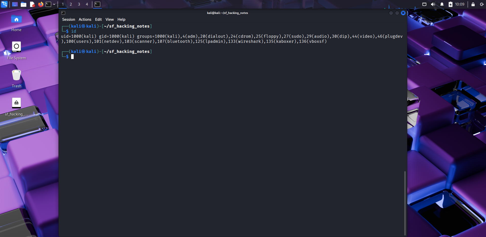
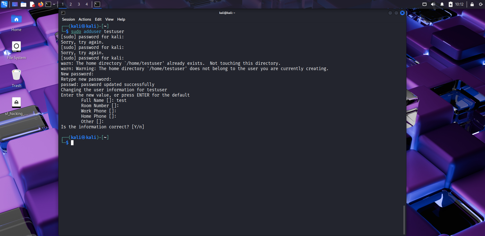
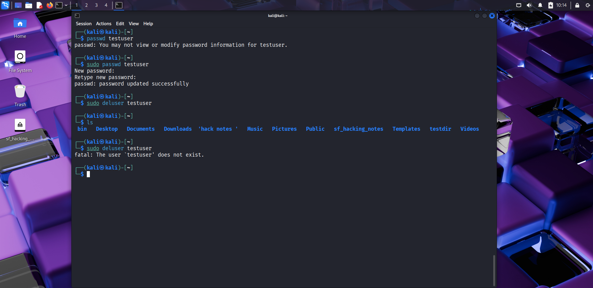
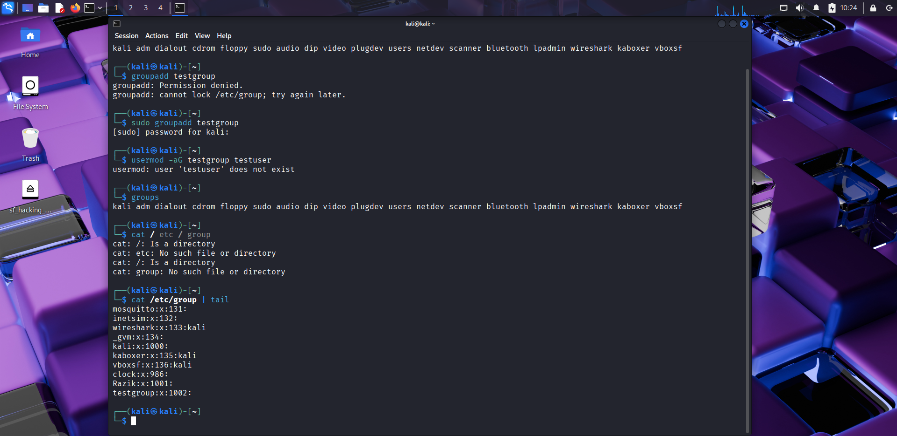
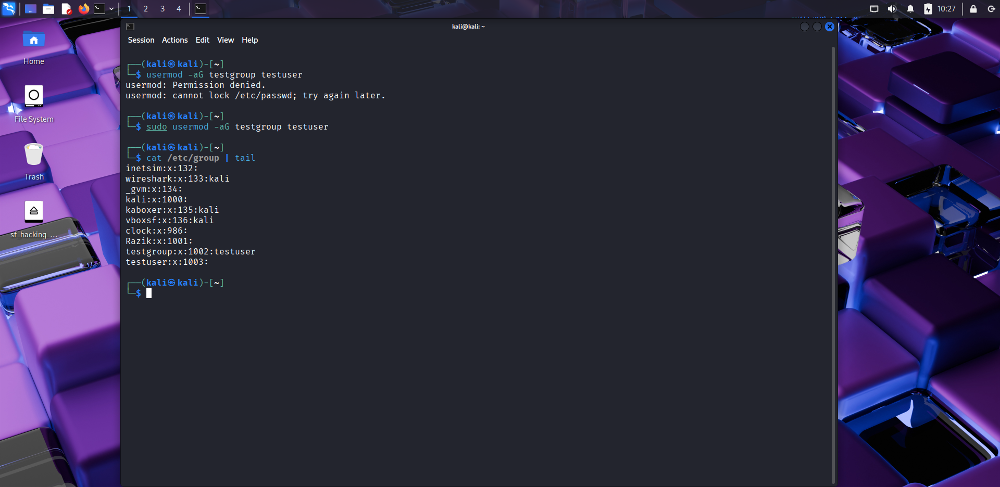
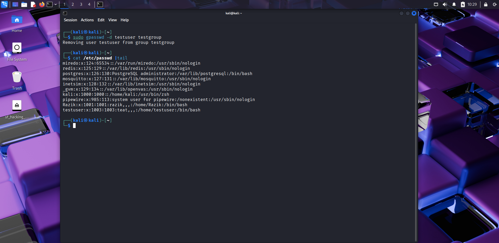
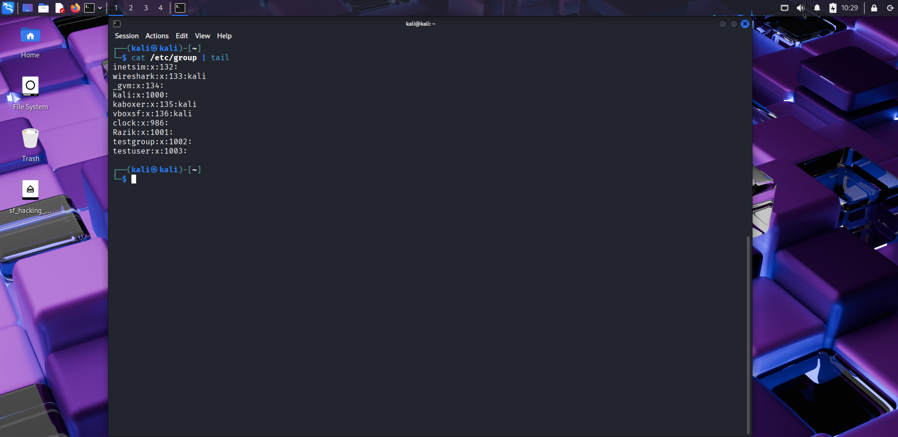

# 👥 Day 11 – User & Group Management  

## 📅 Date: 11/09/2025  

### 🔹 Commands Learned  

#### User Management  
- `whoami` → show current logged-in user  
📸   

- `id` → show user ID (UID) and groups  
📸   

- `adduser testuser` → create new user  
📸   

- `passwd testuser` → set/change password for user  
📸   

- `deluser testuser` → delete user  
📸   

---

#### Group Management  
- `groups` → show groups of current user  
📸   

- `groupadd testgroup` → create new group  
📸   

- `usermod -aG testgroup testuser` → add user to group  
📸   

- `gpasswd -d testuser testgroup` → remove user from group  
📸   

---

#### Checking Users & Groups  
- `cat /etc/passwd | tail` → list system users  
📸   

- `cat /etc/group | tail` → list groups  
📸   

---

### 🔹 Key Learnings  
1. Each user has a **UID** and belongs to one or more groups.  
2. Groups make it easy to manage **permissions for multiple users**.  
3. `adduser` / `deluser` helps manage accounts, while `passwd` changes passwords.  
4. The `/etc/passwd` and `/etc/group` files store user & group details.  

---

### 🔹 Next Steps  
Tomorrow → **Day 12: Permissions in Depth (ACL, umask)**.  

---

### 🔖 Suggested commit message  
`Day 11 – User & Group Management`
