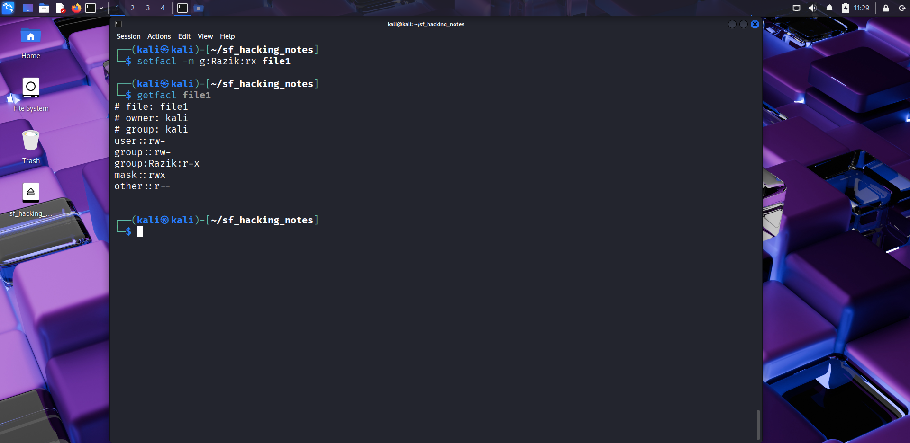
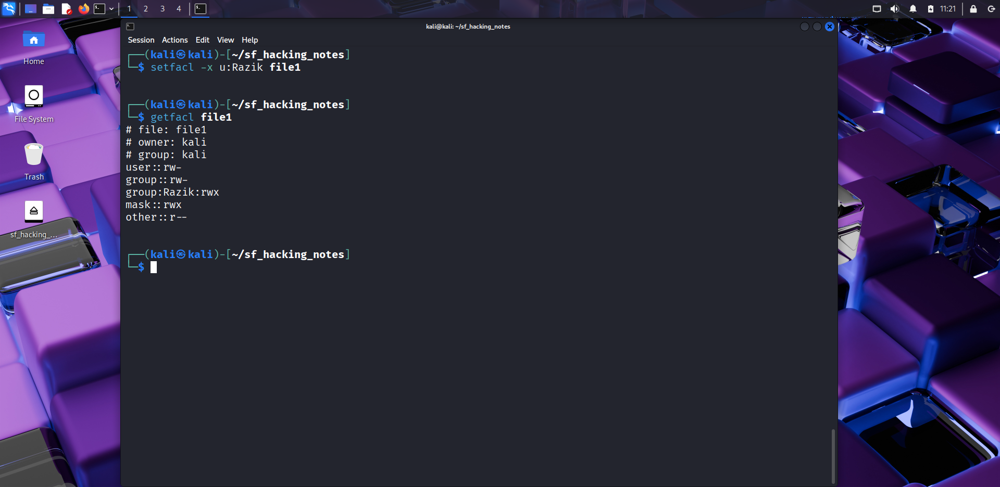
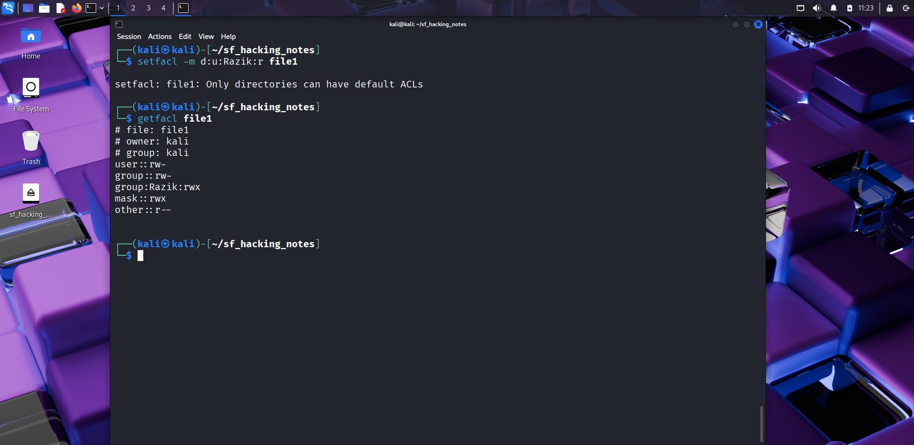
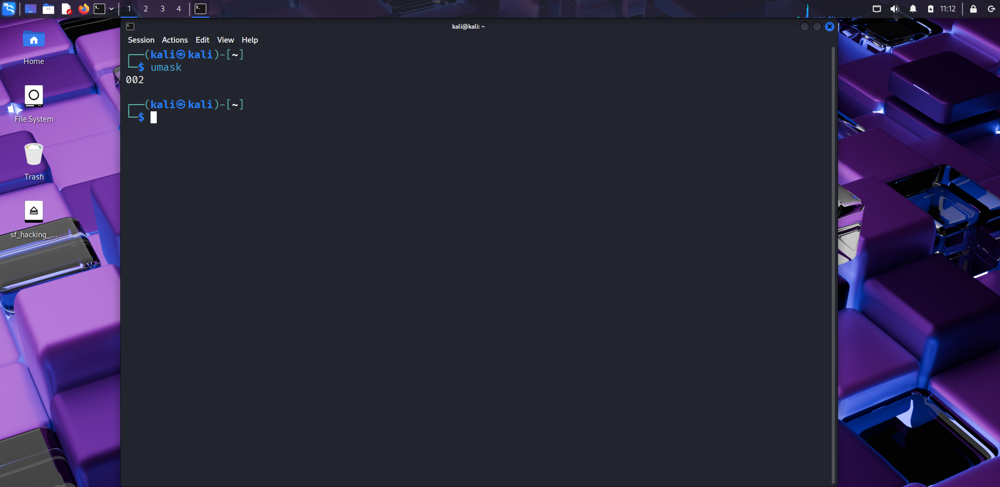

# 🔐 Day 12 – Permissions in Depth (ACL & umask)

## 📅 Date: 23/09/2025

### 🔹 Commands Learned

#### Access Control Lists (ACL)
- `getfacl file.txt` → view ACL of a file  
- `setfacl -m u:username:rwx file.txt` → give specific user rwx permissions  
- `setfacl -m g:groupname:rx file.txt` → give specific group rx permissions  
- `setfacl -x u:username file.txt` → remove ACL entry for user  
- `setfacl -b file.txt` → remove all ACL entries  

#### Default ACL on Directories
- `setfacl -m d:u:username:rwx dir/` → set default ACL for new files in dir  
- `getfacl dir/` → verify default ACLs  

#### umask (Default Permissions)
- `umask` → check current mask  
- `umask 022` → set default so files = 644, dirs = 755  
- `umask 077` → set default so files = 600, dirs = 700  

---

### 🔹 Practical Exercise
📸 Screenshot outputs:
-   
-   
-   
-   
-   
-   
-   

---

### 🔹 Key Learnings
1. **ACLs** allow fine-grained permissions beyond owner/group/others.  
2. `setfacl` and `getfacl` help manage additional users/groups access.  
3. **Default ACLs** propagate permissions automatically to new files in a directory.  
4. **umask** defines the base permissions for newly created files/directories.  
5. Changing umask affects all new files created in that session.  

---

### 🔹 Safety Notes
- Don’t set broad ACLs on sensitive files.  
- Always double-check `getfacl` before/after modifying.  
- Be cautious when lowering umask (e.g., `000` makes everything world-writable).  

---

### 🔹 Next Steps
Tomorrow → **Day 13: Disk Management (df, du, mount, umount, lsblk, fdisk basics).**

---

### 🔖 Suggested commit message
`Day 12 – Permissions in Depth (ACL & umask)`
