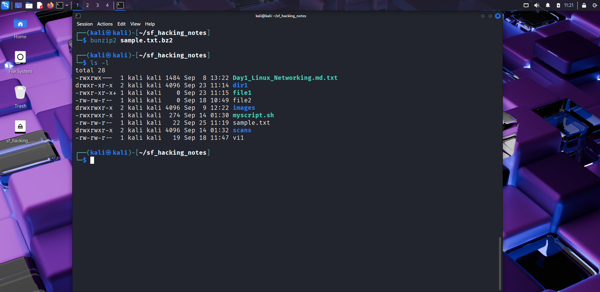
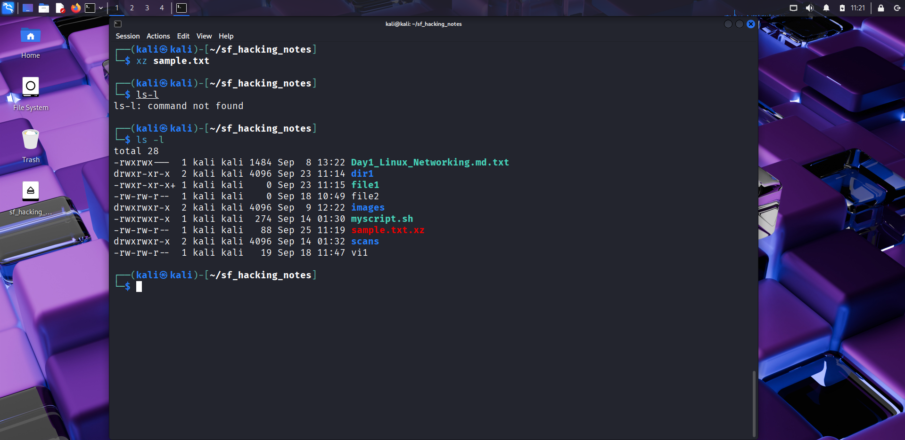
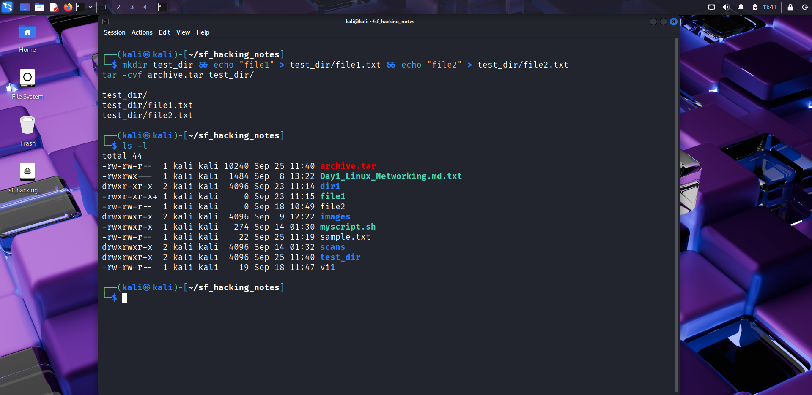
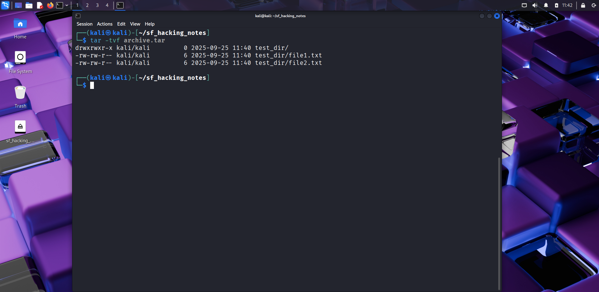

# 🧵 Day 13 – File Compression & Archiving  

## 📅 Date: 25/09/2025  

### 🔹 Commands Learned  

#### Compression (gzip/bzip2/xz)  
- `gzip sample.txt` → compress file (creates `sample.txt.gz`)  
- `gunzip sample.txt.gz` → decompress gzip file  
- `bzip2 sample.txt` → compress file (creates `sample.txt.bz2`)  
- `bunzip2 sample.txt.bz2` → decompress bzip2 file  
- `xz sample.txt` → compress file (creates `sample.txt.xz`)  
- `unxz sample.txt.xz` → decompress xz file  

#### Archiving with tar  
- `tar -cvf archive.tar test_dir/` → create tar archive  
- `tar -xvf archive.tar` → extract archive  
- `tar -tvf archive.tar` → list contents of archive  
- `tar -czvf archive.tar.gz test_dir/` → create compressed tar (gzip)  
- `tar -xzvf archive.tar.gz` → extract compressed tar (gzip)  

---  

### 🔹 Practical Exercise  
📸 Screenshot outputs:  
-   
-   
-   
-   
-   
-   
-   
-   
-   
-   
-   

---  

### 🔹 Key Learnings  
1. `gzip`, `bzip2`, and `xz` compress single files with different algorithms.  
2. `tar` archives multiple files into one package.  
3. You can combine `tar` with compression (`tar.gz`, `tar.bz2`, `tar.xz`).  
4. `tar -tvf` helps preview archive contents before extracting.  
5. Compression is widely used for backups, transfers, and packaging tools.  

---  

### 🔹 Next Steps  
Tomorrow → **Day 14: Linux Networking Tools (ping, traceroute, netstat, ss, curl, wget).**  

---  

✅ Suggested commit message:  
```bash
git commit -m "🧵 Day 13 – File Compression & Archiving practice completed"
