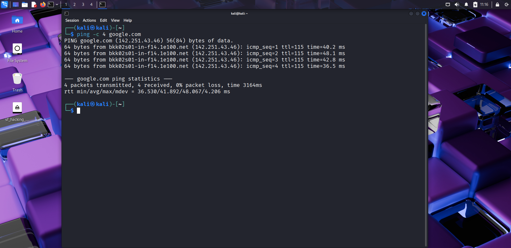
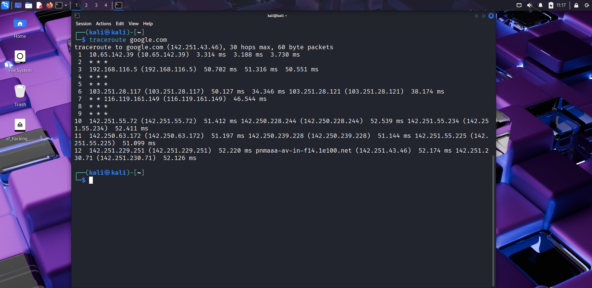
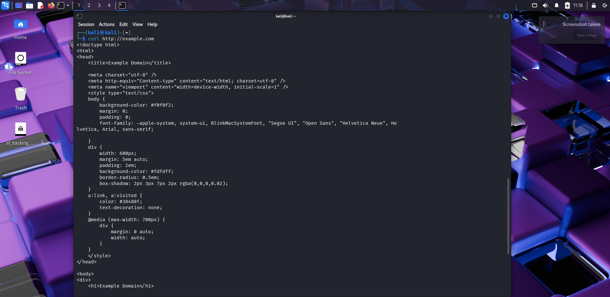
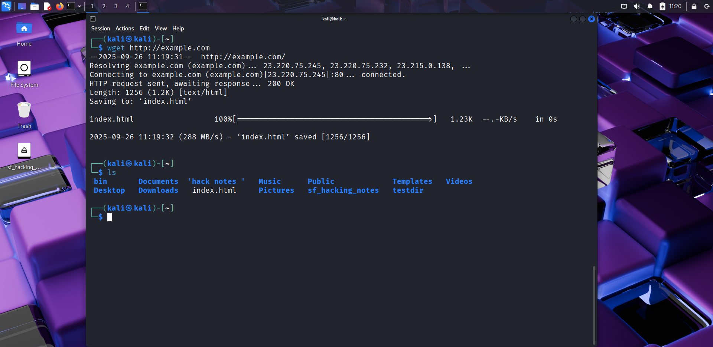
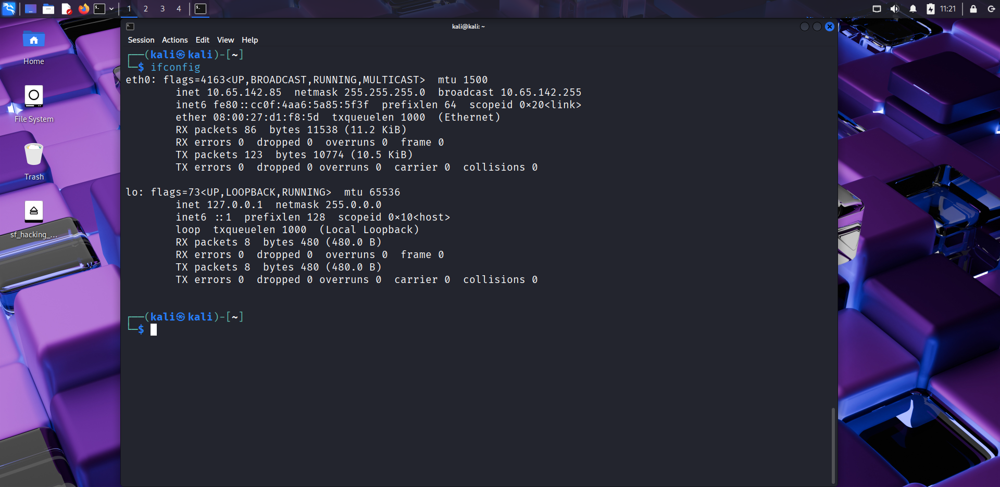
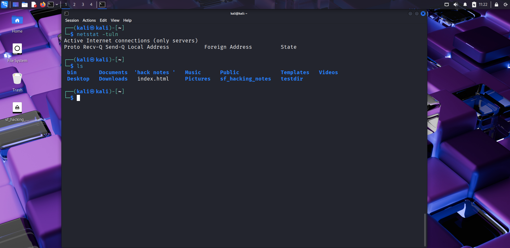
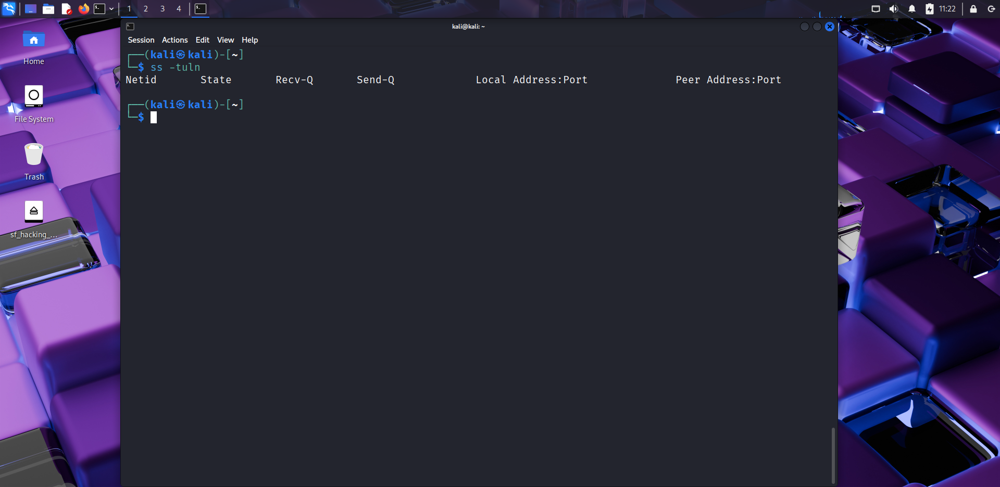

# 🌐 Day 14 – Linux Networking Tools  

## 📅 Date: 26/09/2025  

### 🔹 Commands Learned  

#### Basic Network Utilities  
- `ping google.com` → check connectivity to a host  
- `traceroute google.com` → trace the path packets take to the destination  
- `curl http://example.com` → fetch data from a URL  
- `wget http://example.com/file.zip` → download files from the web  

#### Network Information  
- `ifconfig` or `ip a` → show network interfaces & IP addresses  
- `netstat -tuln` → show listening ports and services  
- `ss -tuln` → modern replacement for netstat  

---  

### 🔹 Practical Exercise  
📸 Screenshot outputs:  
-   
-   
-   
-   
-   
-   
-   

---  

### 🔹 Key Learnings  
1. `ping` is used to test basic connectivity.  
2. `traceroute` shows the path your packets travel.  
3. `curl` and `wget` help download or interact with web servers.  
4. `ifconfig`/`ip a` provide IP and interface details.  
5. `netstat` and `ss` reveal listening services and ports.  
6. These tools are essential for **network troubleshooting & reconnaissance**.  

---  

### 🔹 Next Steps  
Tomorrow → **Day 15: User Management (adduser, userdel, passwd, groups, id).**  

---  

✅ Suggested commit message:  
```bash
git commit -m "🌐 Day 14 – Linux Networking Tools practice completed"
