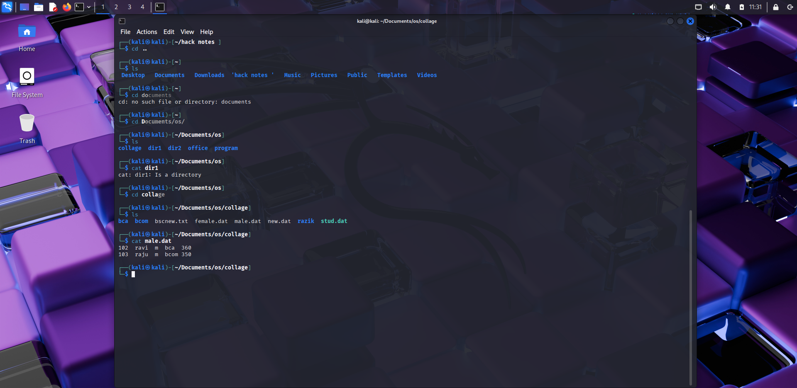
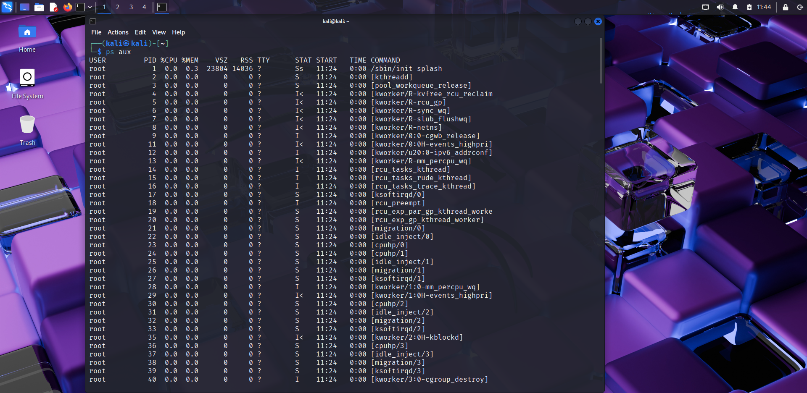
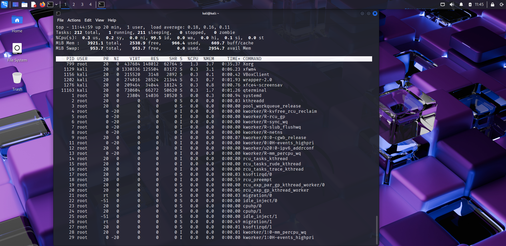

# 🧑‍💻 Day 2 – Linux File & Process Management

## 📅 Date: 09/09/2025

### 🔹 Commands Learned

#### File Operations
- ls -l
- cat filename.txt
- less filename.txt (exit with `q`)
- head filename.txt
- tail filename.txt
- nano filename.txt

#### Process Management
- ps aux
- top  (exit with `q`)
- kill -9 <PID>

#### File Permissions
- chmod 755 filename
- chmod 644 filename

---

### 🔹 Practical Exercise
📸 Screenshot outputs:
- 
- 
- 
- 
- 
- 

---

### 🔹 Key Learnings
1. `ls -l` shows file permissions, owners, and details.  
2. `cat`, `less`, `head`, `tail` let me read files in different ways.  
3. `nano` is a simple text editor inside terminal.  
4. `ps aux` and `top` help me monitor processes.  
5. `kill` can stop a process by its PID.  
6. `chmod` changes who can read/write/execute a file.  
7. These commands are essential for hackers to explore files, monitor processes, and manage permissions on a target system.  

---

### 🔹 Next Steps
Tomorrow → Linux Users & Permissions in detail.
