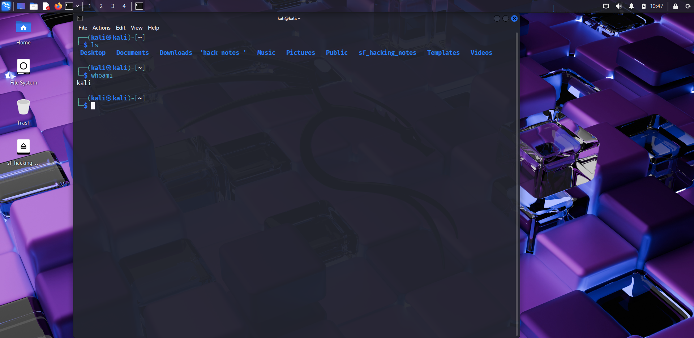
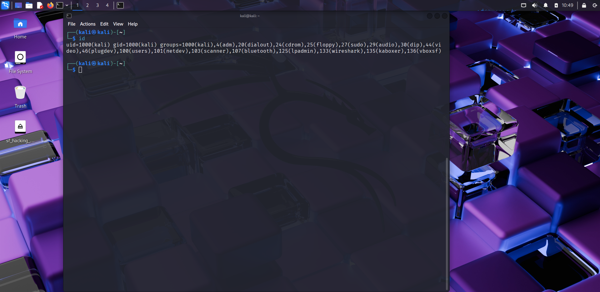
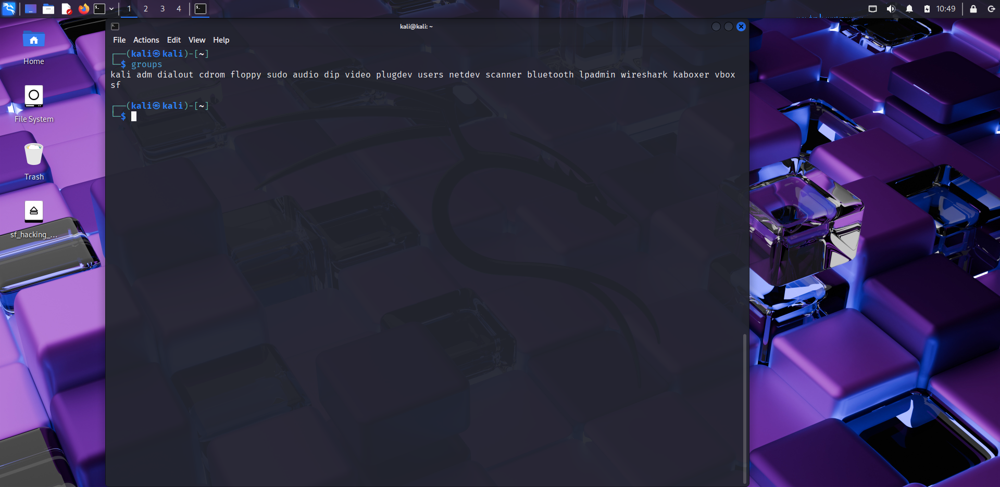
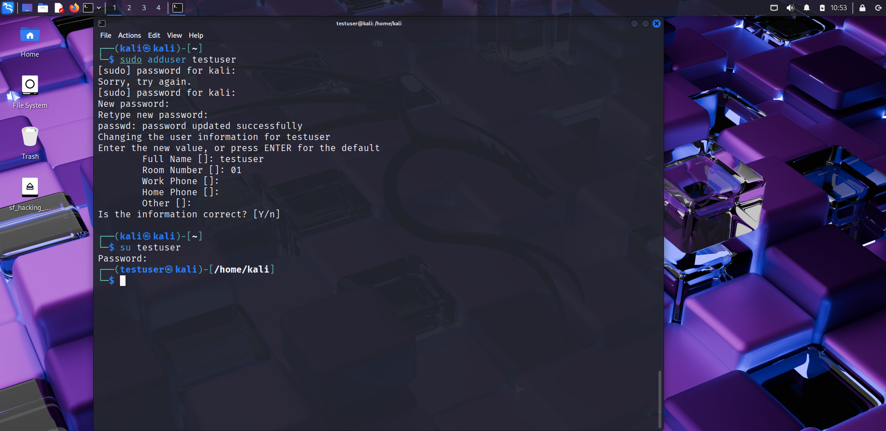
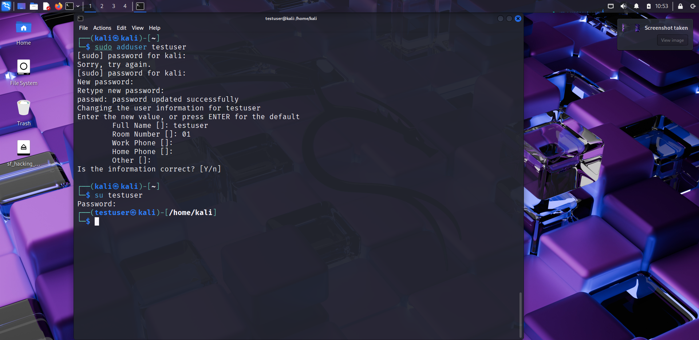
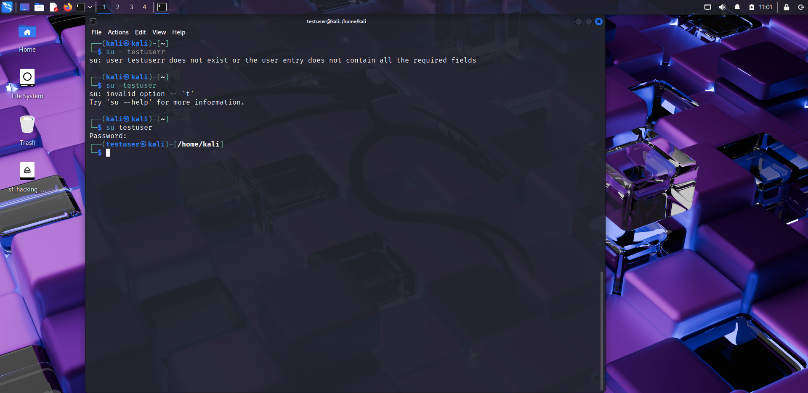
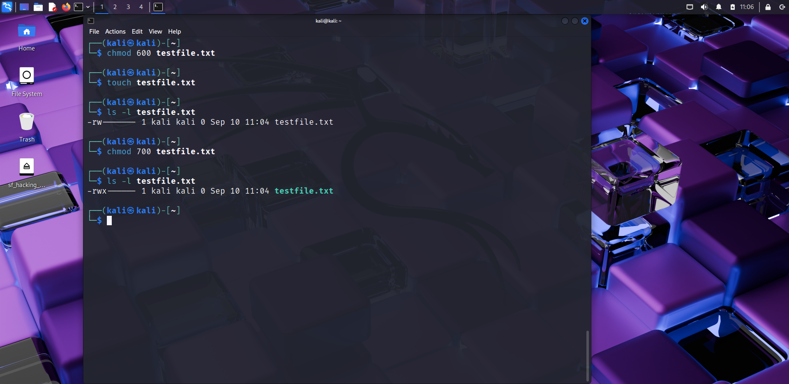

# 👤 Day 3 – Linux Users & Permissions

## 📅 Date: 03/09/2025

### 🔹 Commands Learned

#### User Info
- whoami
- id
- groups
- users
- who

#### User Management
- adduser testuser
- passwd testuser
- su - testuser
- deluser testuser

#### Permissions
- ls -l (check file permissions)
- chmod 600 filename
- chmod 700 filename
- chown testuser:testuser filename

---

### 🔹 Practical Exercise
📸 Screenshot outputs:
- 
- 
- 
- 
- 
- 
- 
- 

---

### 🔹 Key Learnings
1. `whoami` shows current logged-in user.  
2. `id` displays user ID and groups.  
3. `adduser` creates a new user, and `passwd` sets password.  
4. `su - user` switches to another user.  
5. `chmod` changes file permissions.  
6. `chown` changes file ownership.  
7. Understanding users & permissions is critical for ethical hacking (privilege escalation, file access, etc.).

---

### 🔹 Next Steps
Tomorrow → Day 4: File Searching & System Monitoring.
