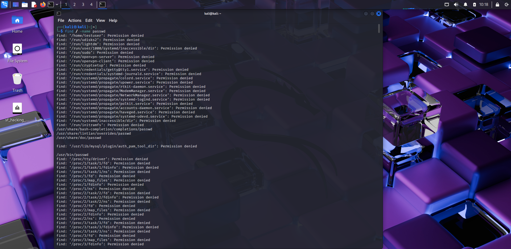
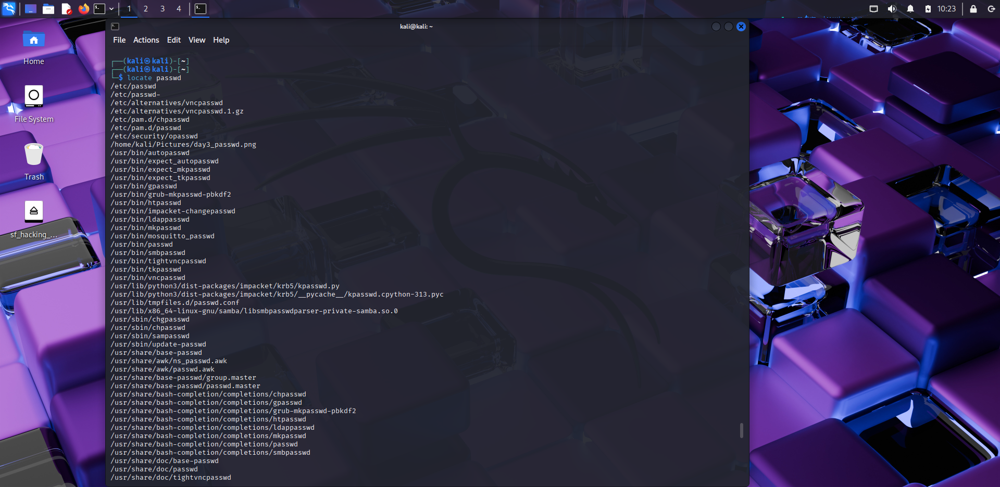
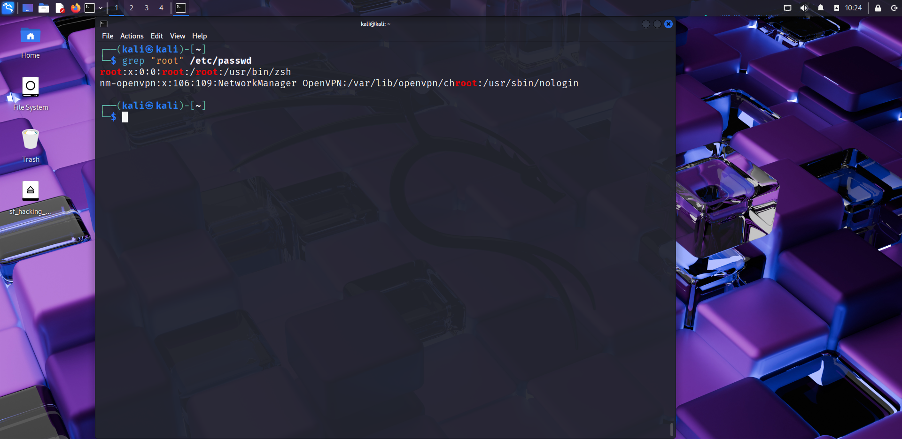
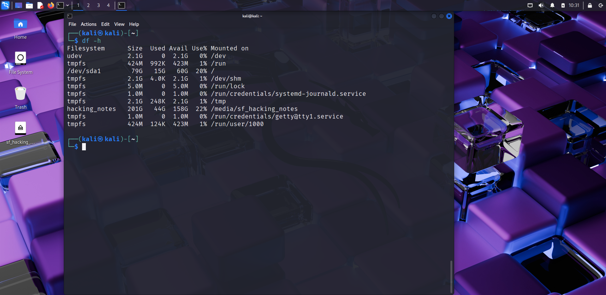
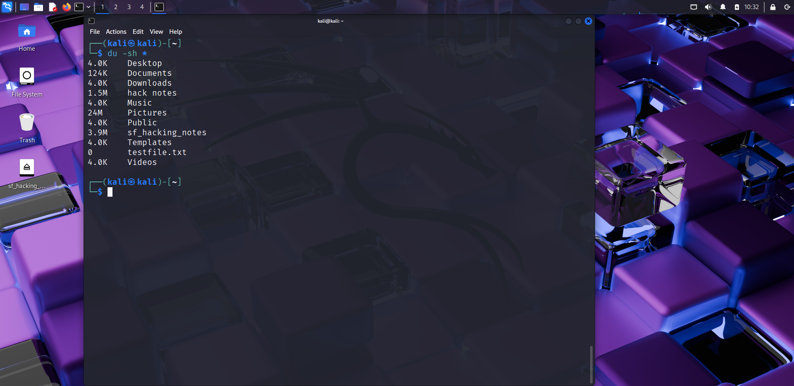
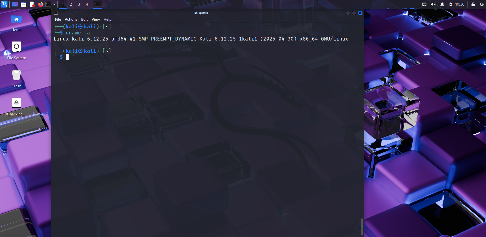
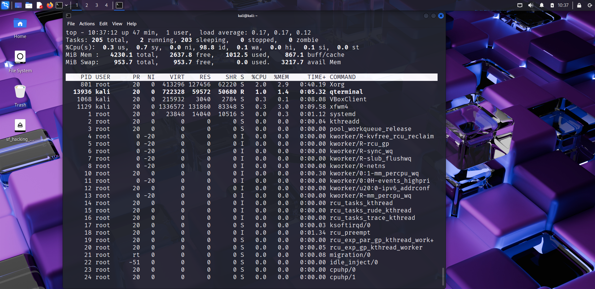
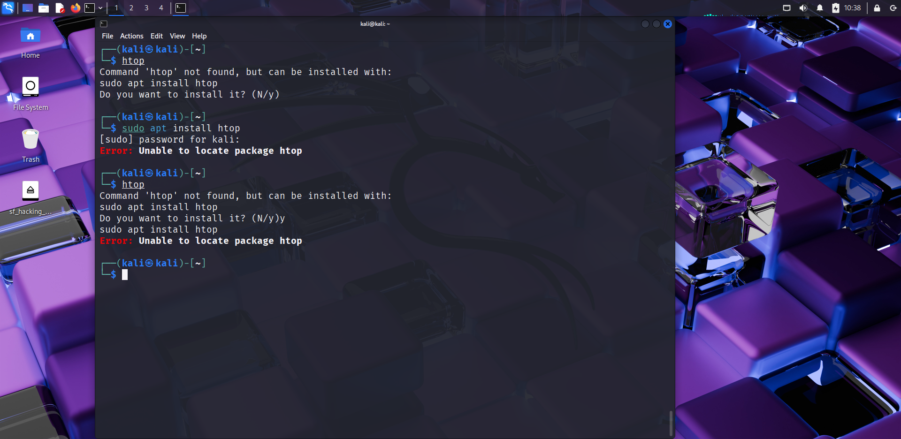

# 🔍 Day 4 – File Searching & System Monitoring

## 📅 Date: 11/09/2025

### 🔹 Commands Learned

#### File Searching
- find / -name filename.txt
- locate filename.txt
- grep "word" filename.txt
- grep -r "word" /path/

#### Disk & Memory Usage
- df -h
- du -sh *
- free -h

#### System Info & Monitoring
- uptime
- uname -a
- top (exit with `q`)
- htop (if installed)

---

### 🔹 Practical Exercise
📸 Screenshot outputs:
- 
- 
- 
- 
- 
- 
- 
- 
- 
- 

---

### 🔹 Key Learnings
1. `find` and `locate` help me search for files on the system.  
2. `grep` is powerful for searching text inside files.  
3. `df` and `du` show disk usage, while `free` shows RAM usage.  
4. `uptime` tells how long the system is running.  
5. `uname -a` shows system info (kernel, architecture, etc.).  
6. `top`/`htop` monitor active processes.  
7. These are essential for hackers to explore, monitor, and analyze systems during penetration testing.

---

### 🔹 Next Steps
Tomorrow → Day 5: Linux Package Management & Services.
