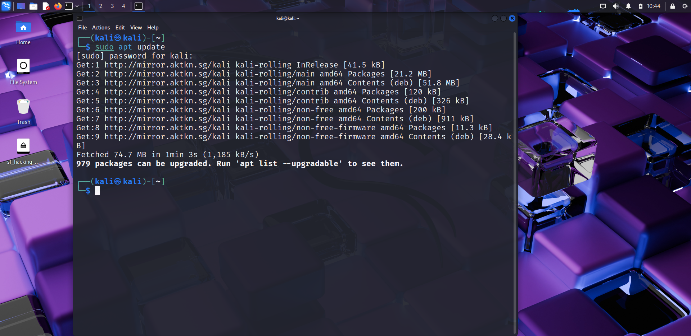
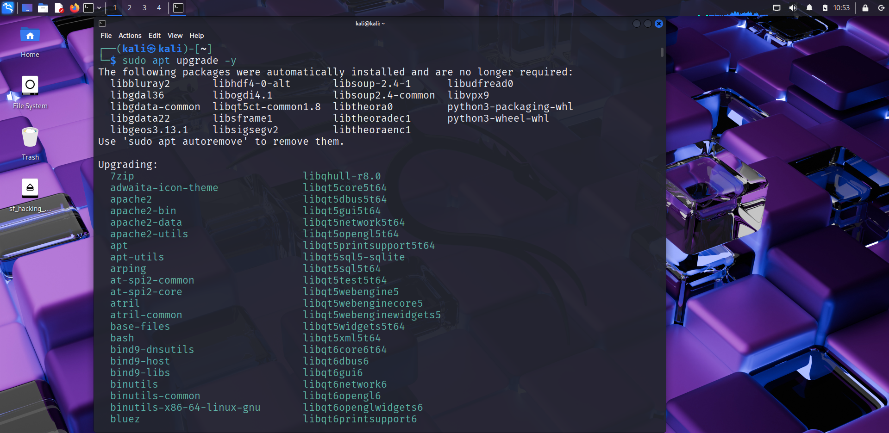
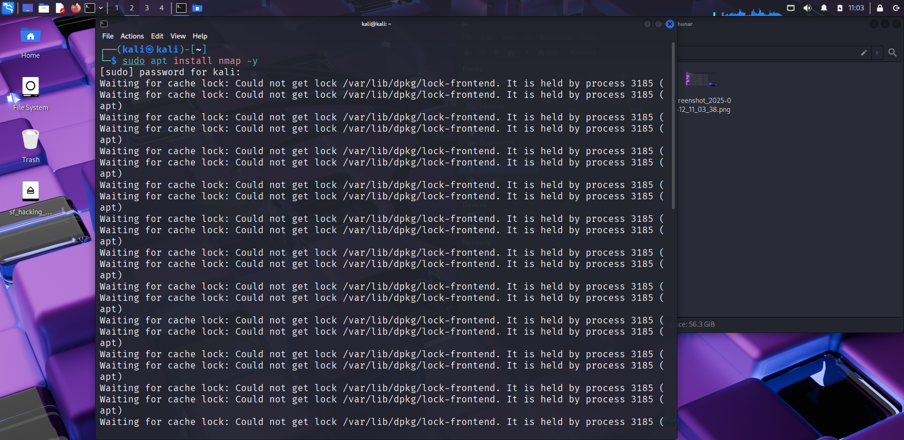
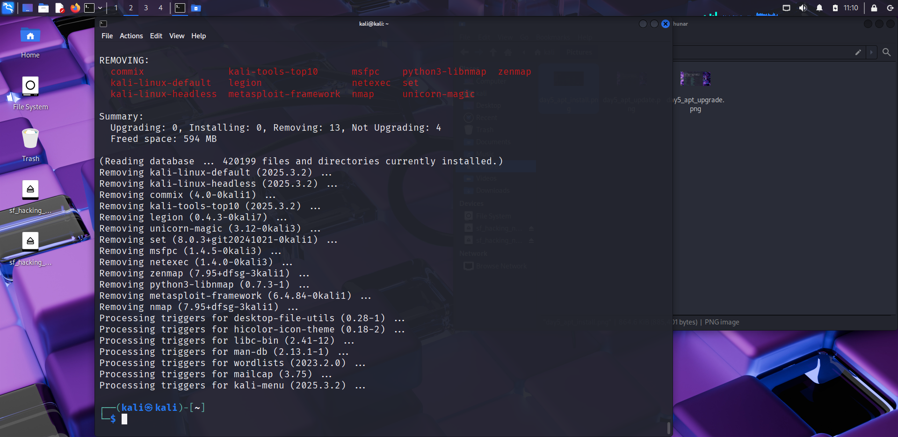
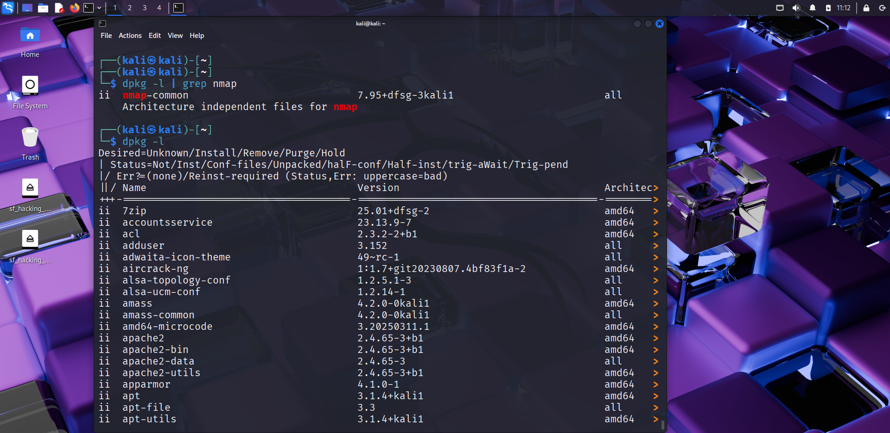
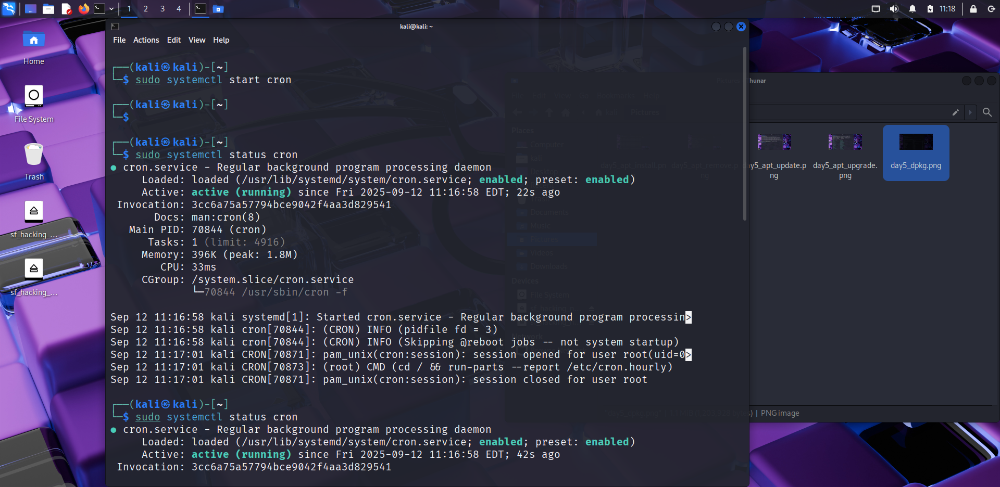
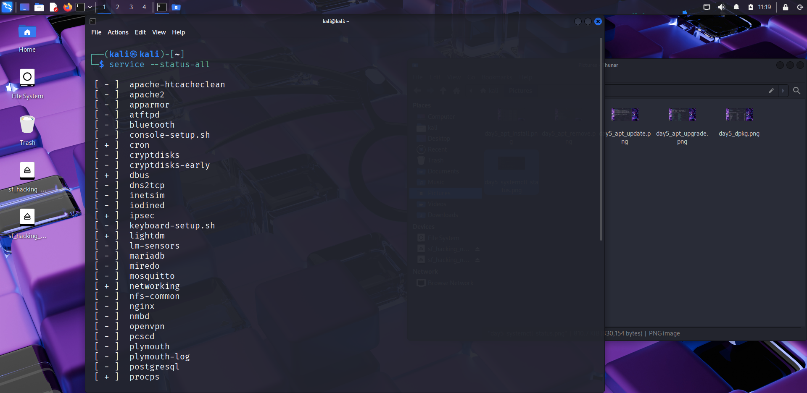

# 📦 Day 5 – Linux Package Management & Services

## 📅 Date: 12/09/2025

---

## 🔹 Commands Learned

### Package Management (Debian/Ubuntu/Kali)
- `sudo apt update` → refresh package list  
- `sudo apt upgrade` → upgrade installed packages  
- `sudo apt install package_name` → install software  
- `sudo apt remove package_name` → remove software  
- `sudo apt search package_name` → search for a package  
- `dpkg -l` → list installed packages  
- `dpkg -i package.deb` → install from a .deb file  

### Service Management
- `systemctl start service_name` → start a service  
- `systemctl stop service_name` → stop a service  
- `systemctl restart service_name` → restart a service  
- `systemctl status service_name` → check service status  
- `service --status-all` → list all services  

---

## 🔹 Practical Exercise (Screenshots 📸)
-   
-   
-   
-   
-   
-   
-   

---

## ⚡ Bonus Hacker Exercise – Install & Use `nmap`

1. **Install `nmap`:**
   ```bash
   sudo apt update
   sudo apt install nmap

🔹 Key Learnings

apt is the package manager for Debian-based distros (like Kali).

dpkg handles individual .deb files.

systemctl and service manage running services.

Hackers rely on package managers to install tools quickly.

nmap is one of the most important tools for network scanning.

Running nmap on localhost gives your first real hacking experience.


