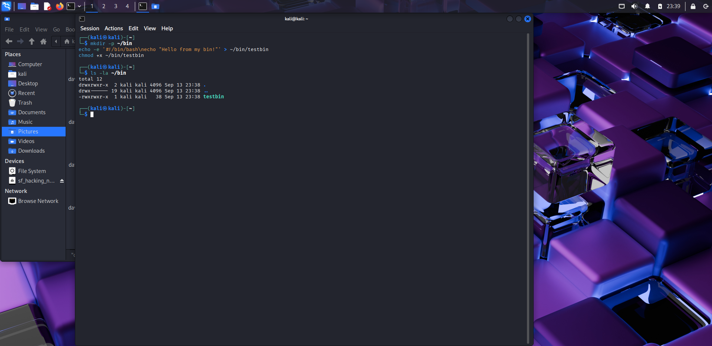
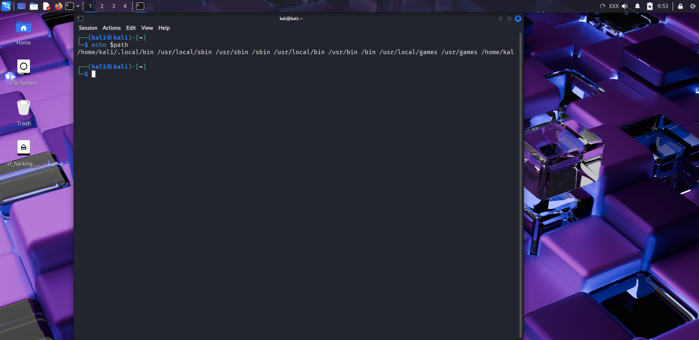
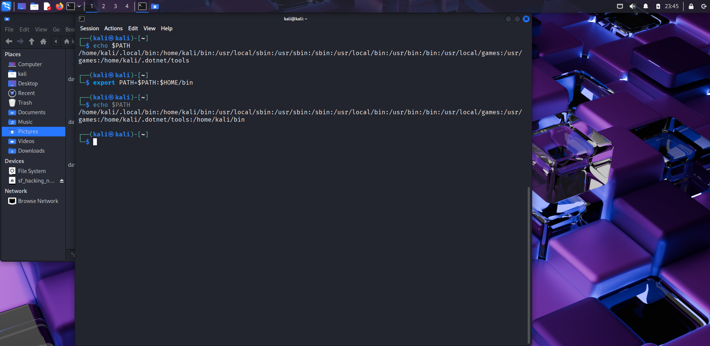
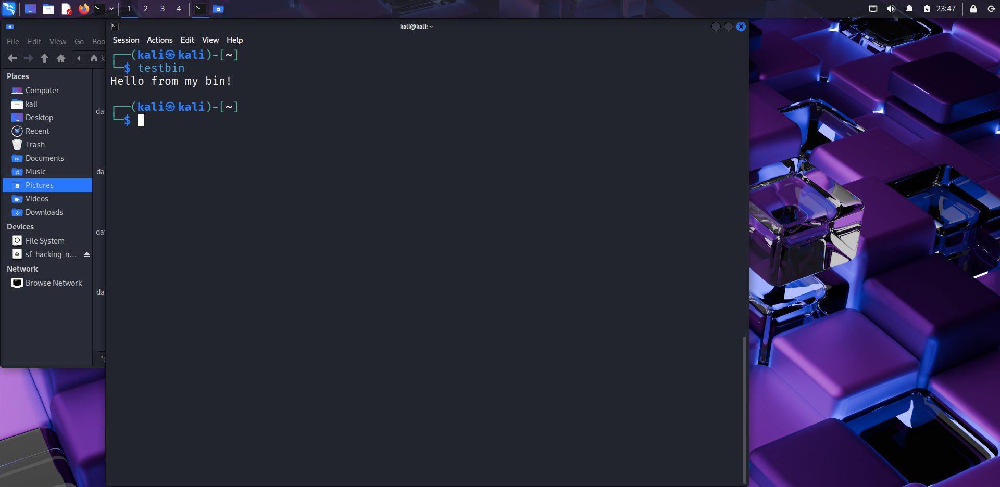
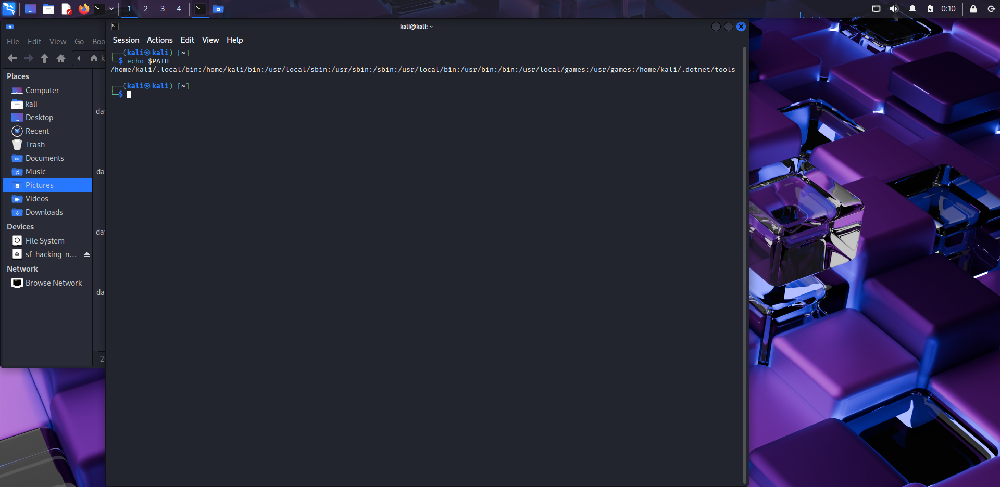
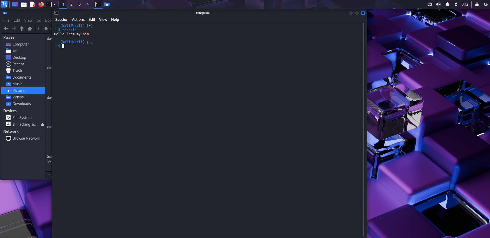
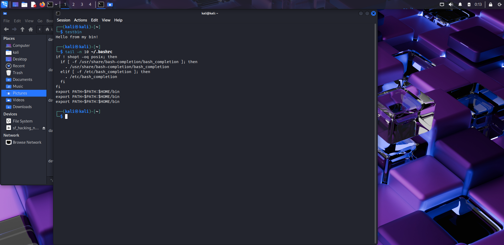

# 🐧 Day 6 – Linux Environment Variables & PATH Setup

## 📅 Date: 13/09/2025

### 🔹 Commands Learned

#### Environment Variables
- `echo $PATH` → show PATH (where executables are found)  
- `echo $HOME` → show home directory   
- `env` / `printenv` → list environment variables  
- `printenv PATH` → print PATH only  
- `export MYVAR="hello"` → set a temporary variable in current shell  
- `echo $MYVAR` → read the variable  
- `unset MYVAR` → remove the variable  
- `set | less` → list all shell variables

#### PATH & Personal bin
- `mkdir -p ~/bin` → create personal bin directory  
- `echo -e '#!/bin/bash\necho "Hello from my bin!"' > ~/bin/testbin` → create a test script  
- `chmod +x ~/bin/testbin` → make it executable  
- `export PATH=$PATH:$HOME/bin` → add `~/bin` to PATH for current session  
- `echo 'export PATH=$PATH:$HOME/bin' >> ~/.bashrc` → make the PATH change persistent  
- `source ~/.bashrc` → reload bash config immediately

---

### 🔹 Practical Exercise
📸 Screenshot outputs:
-   
-   
-   
-   
-   
-   
- 

**Quick step checklist to run in terminal**
1. `mkdir -p ~/bin`  
2. `echo -e '#!/bin/bash\necho "Hello from my bin!"' > ~/bin/testbin`  
3. `chmod +x ~/bin/testbin` → screenshot `day6_bin_create.png` (run `ls -la ~/bin`)  
4. `echo $PATH` → screenshot `day6_echo_path_before.png`  
5. `export PATH=$PATH:$HOME/bin`  
6. `echo $PATH` → screenshot `day6_export_path_temp.png`  
7. `testbin` → screenshot `day6_testbin_temp.png`  
8. `echo 'export PATH=$PATH:$HOME/bin' >> ~/.bashrc`  
9. `source ~/.bashrc`  
10. `echo $PATH` → screenshot `day6_export_path_permanent.png`  
11. `testbin` → screenshot `day6_testbin_permanent.png`  
12. `tail -n 10 ~/.bashrc` → screenshot `day6_bashrc_tail.png`

---

### 🔹 Key Learnings
1. `$PATH` tells the shell where to look for executables.  
2. `export` sets environment variables for the current session; adding the export to `~/.bashrc` makes it persistent.  
3. Placing scripts in `~/bin` and adding that directory to `PATH` lets you run your custom tools from anywhere.  
4. `unset` removes variables; `env` / `printenv` / `set` list variables.  
5. Environment variables and PATH setup are essential for automation and building small toolkits in ethical hacking.

---

### 🔹 Safety & Notes
- The test script `testbin` is safe and local.  
- Don’t add untrusted folders to your PATH.  
- Keep changes to `~/.bashrc` minimal and review before saving.

---
