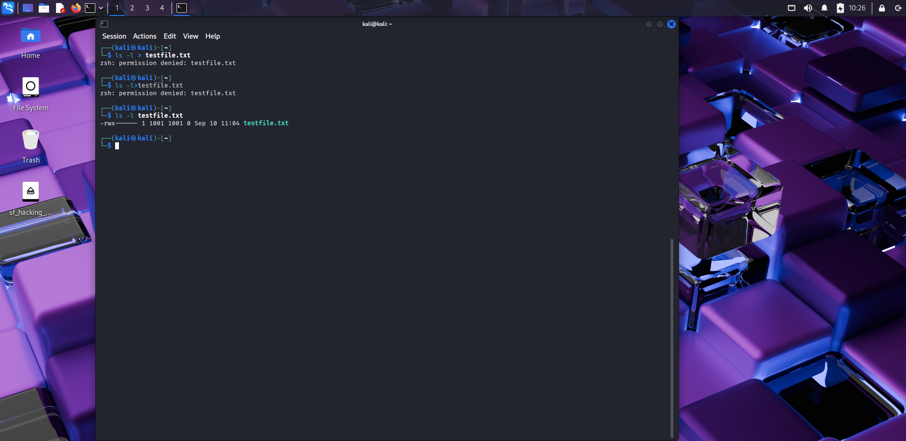
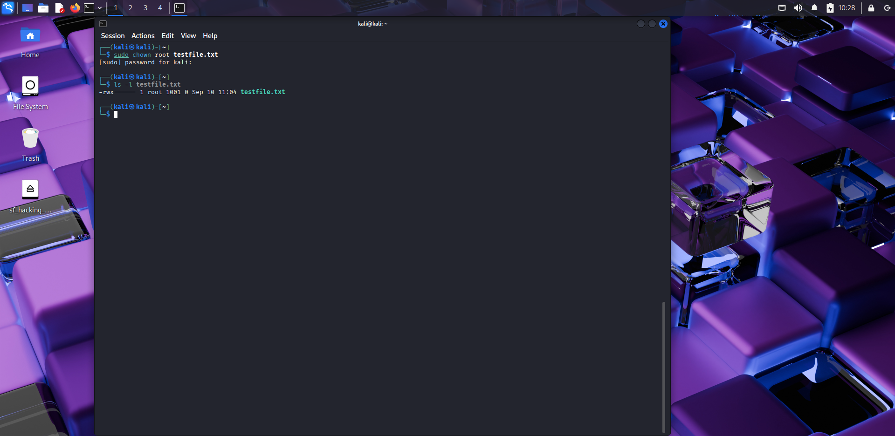
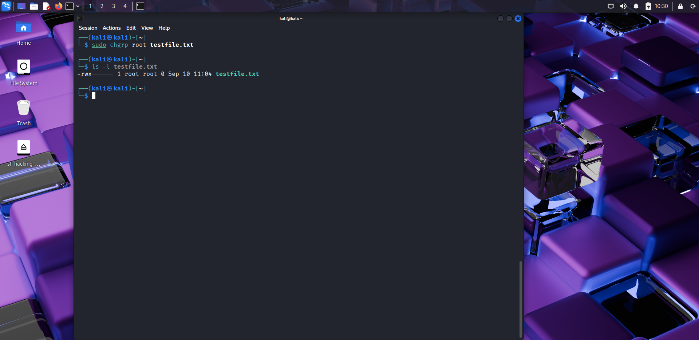
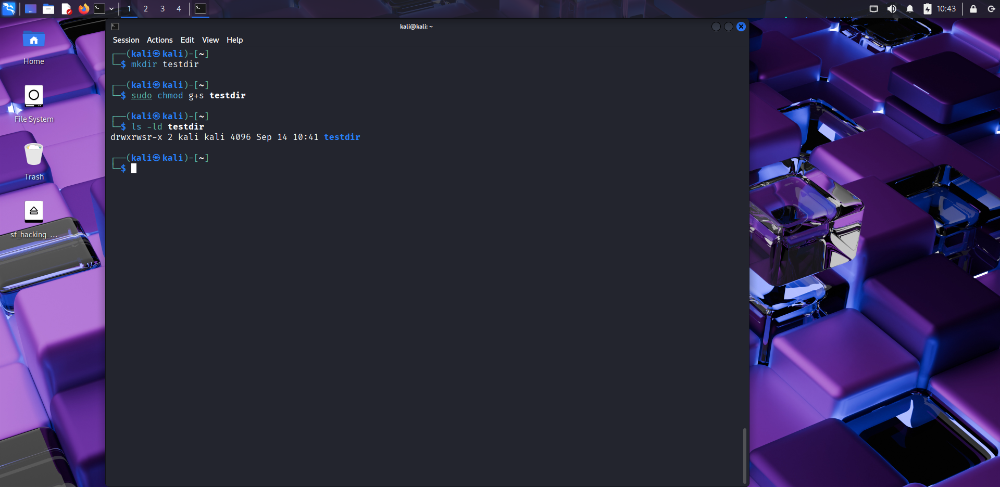
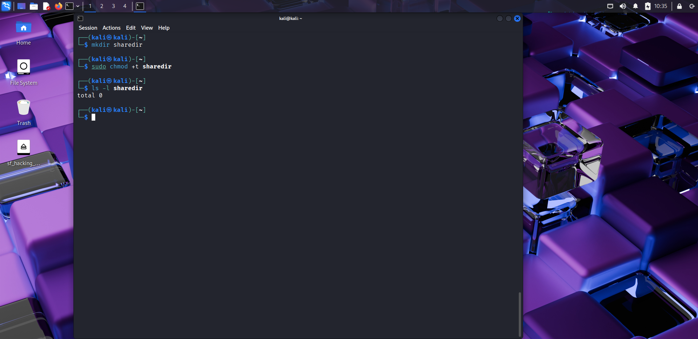
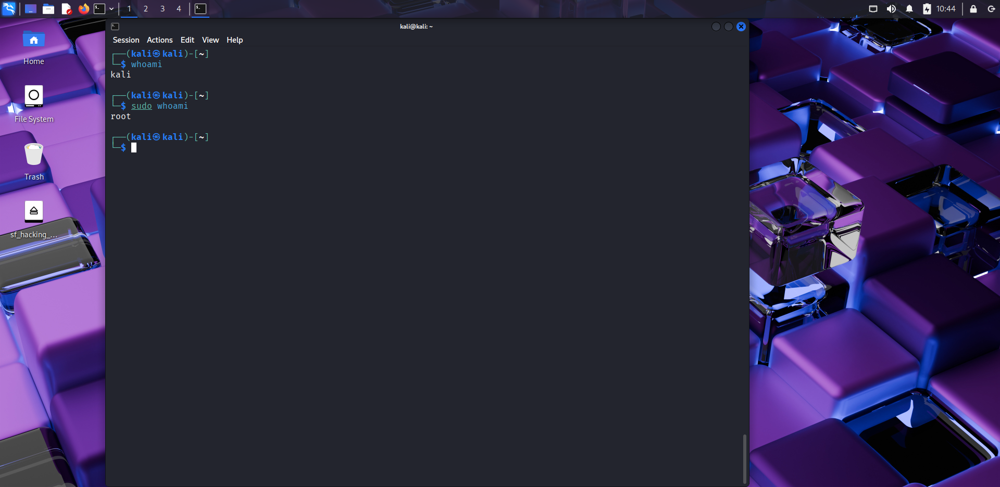
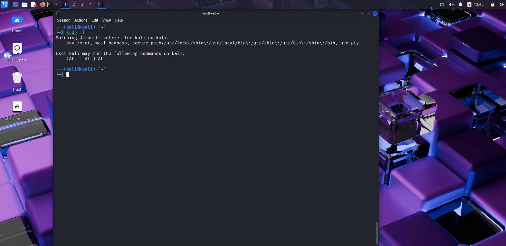

# 🔐 Day 7 – Advanced File Permissions & Ownership

## 📅 Date: 14/09/2025

### 🔹 Commands Learned

#### Ownership & Groups
- `ls -l` → show file ownership (user/group)  
- `chown user file` → change file owner  
- `chown user:group file` → change owner and group  
- `chgrp group file` → change group  

#### Special Permissions
- `chmod u+s file` → set **SUID** (run as file owner)  
- `chmod g+s dir` → set **SGID** (new files inherit group)  
- `chmod +t dir` → set **Sticky bit** (only owner can delete files inside)  

#### Sudo Basics
- `sudo command` → run command as root  
- `sudo -l` → list allowed sudo commands  
- `whoami` (with/without sudo) → check effective user  

---

### 🔹 Practical Exercise
📸 Screenshot outputs:
-   
-   
-   
-   
-   
-   
-   
-   

---

### 🔹 Key Learnings
1. Every file has an **owner** and a **group**.  
2. `chown` and `chgrp` let you reassign ownership and group.  
3. **SUID**: if set on an executable, it runs with the **owner’s privileges**.  
4. **SGID**: if set on a directory, new files inherit the **group** of that directory.  
5. **Sticky bit**: on shared directories (like `/tmp`), only the file owner can delete their own files.  
6. `sudo` is used to temporarily gain root privileges; misuse can break the system.  

---

### 🔹 Safety Notes
- Don’t set SUID/SGID on unknown binaries.  
- Always check with `ls -l` before/after changing permissions.  
- Practice only on test files/directories, not system files.  

---

### 🔹 Next Steps
Tomorrow → **Day 8: Processes & Job Control (fg, bg, jobs, kill, signals).**

---

### 🔖 Suggested commit message
