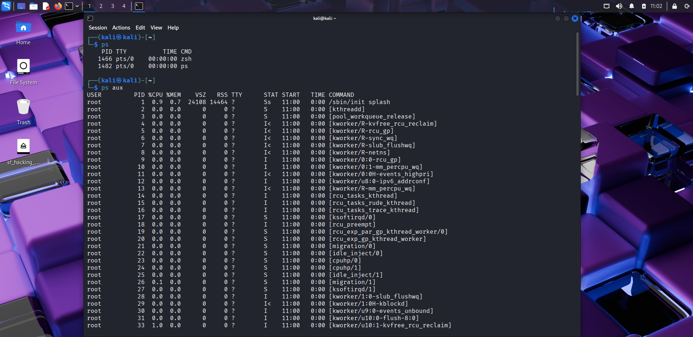
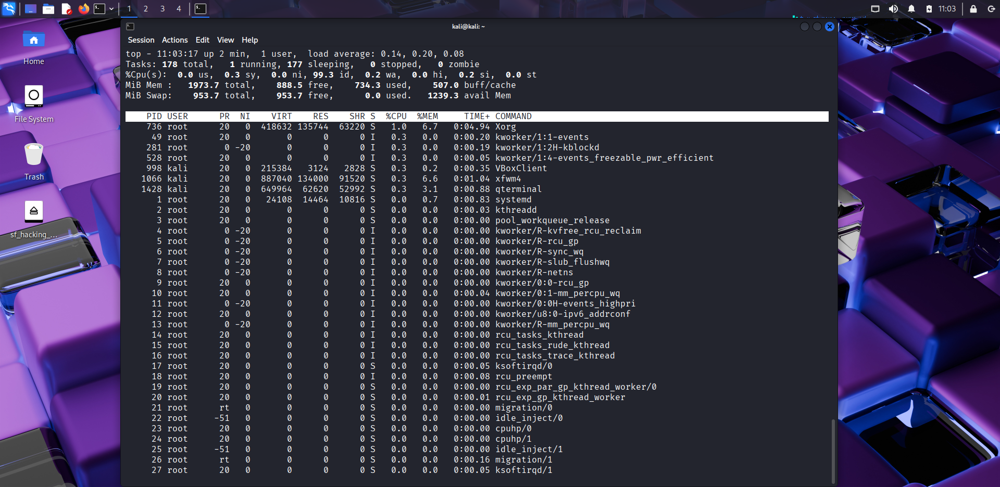
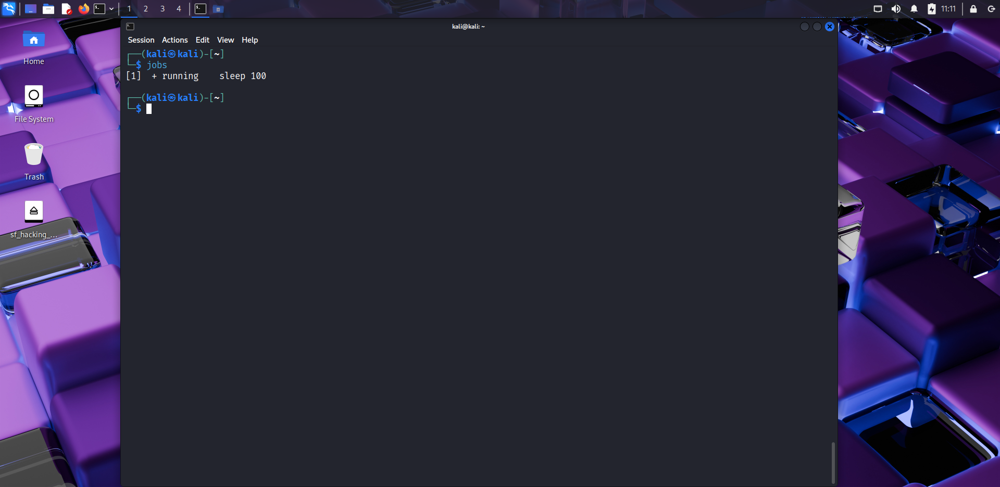
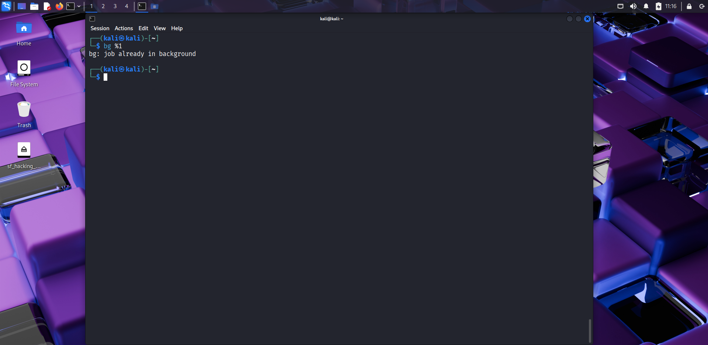
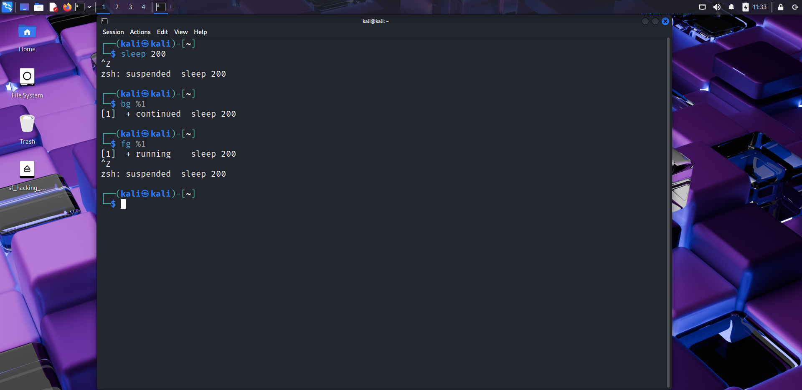
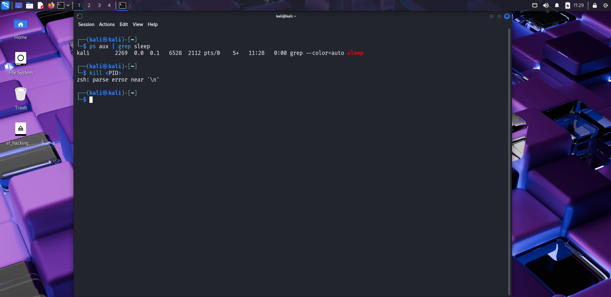

# ⚙️ Day 8 – Processes & Job Control  

## 📅 Date: 15/09/2025  

### 🔹 Commands Learned  

#### Process Monitoring  
- `ps` → show running processes for current user  
- `ps aux` → detailed list of all processes  
- `top` → live process monitoring (press `q` to quit)  
- `htop` (if installed) → interactive process monitor  

#### Background & Foreground Jobs  
- `sleep 100 &` → run process in background  
- `jobs` → list background jobs  
- `fg %1` → bring job 1 to foreground  
- `bg %1` → resume job 1 in background  

#### Suspending & Resuming  
- `Ctrl+Z` → suspend a process  
- `jobs` → check stopped processes  
- `bg %job` → continue job in background  
- `fg %job` → continue job in foreground  

#### Killing Processes  
- `ps aux | grep sleep` → find process ID (PID) of sleep  
- `kill <PID>` → terminate process  
- `kill -9 <PID>` → force kill process  

---

### 🔹 Practical Exercise  
📸 Screenshot outputs:  
-   
-   
-   
-   
-   
-   
-   
-   
-   
-   

---

### 🔹 Key Learnings  
1. `ps` and `top` help monitor active processes.  
2. Jobs can run in the background using `&`.  
3. `fg` and `bg` allow switching jobs between foreground/background.  
4. `Ctrl+Z` suspends a running process.  
5. `kill` is used to terminate processes gracefully, while `kill -9` forcefully ends them.  
6. Managing jobs is crucial for multitasking in Linux.  

---

### 🔹 Next Steps  
Tomorrow → **Day 9: File Searching & Filtering (find, locate, grep, cut, sort, uniq, wc).**  

---

### 🔖 Suggested commit message  
