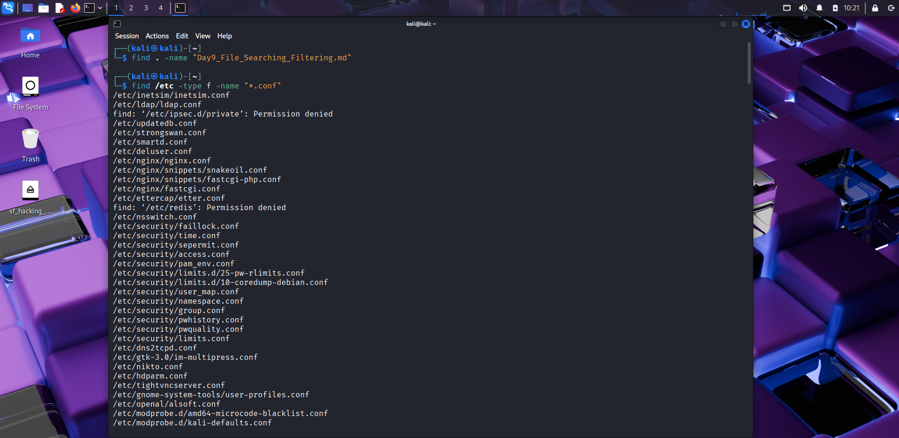
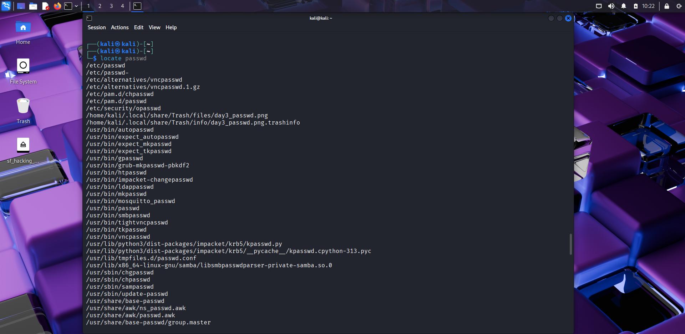
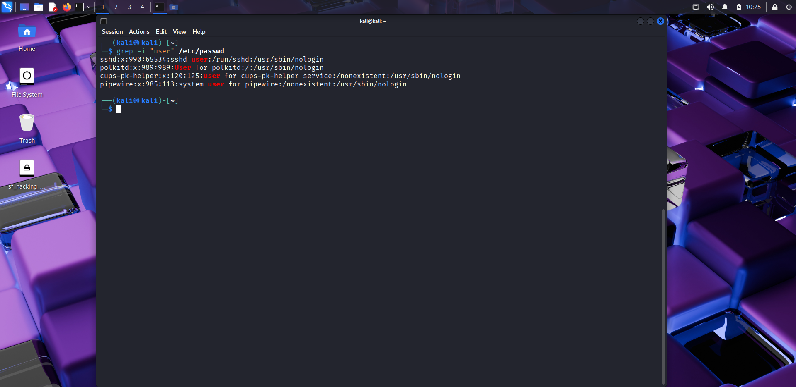
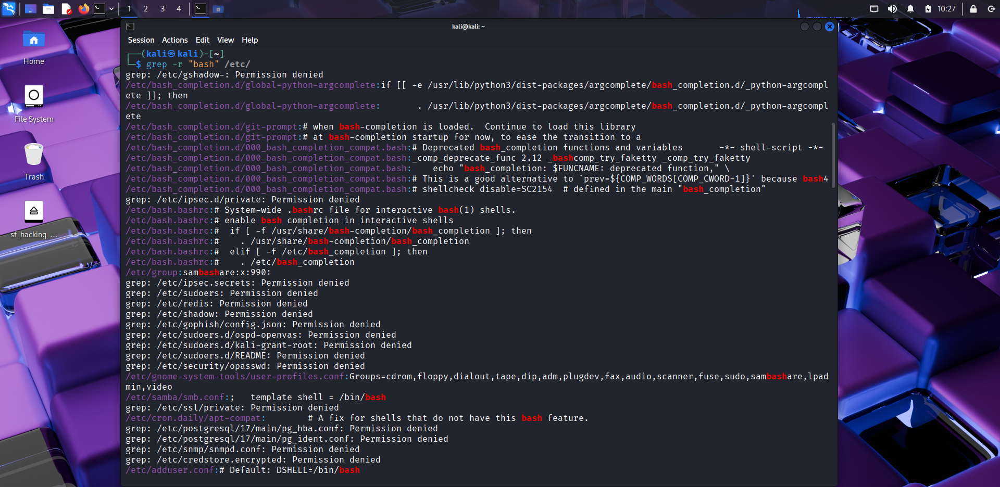
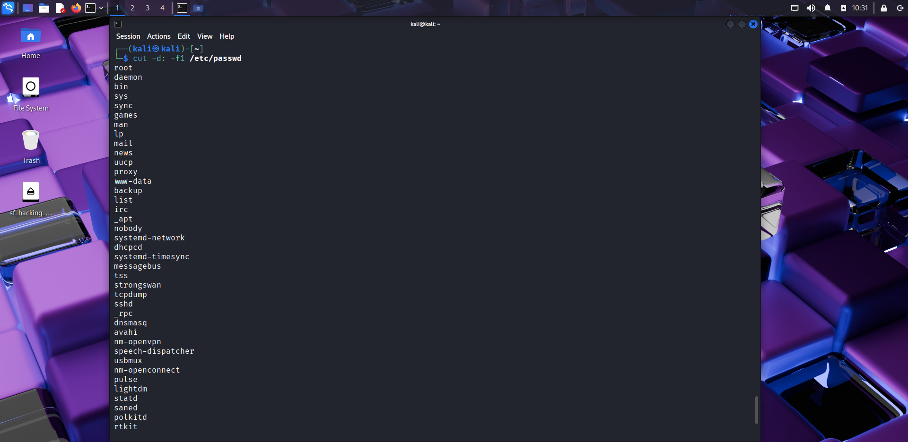
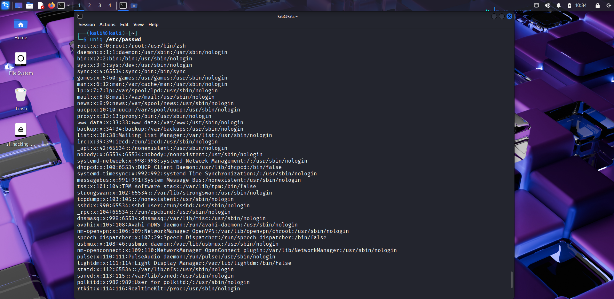

# 🔍 Day 9 – File Searching & Filtering  

## 📅 Date: 16/09/2025  

### 🔹 Commands Learned  

#### File Searching  
- `find . -name filename` → search file in current directory  
- `find /etc -type f -name "*.conf"` → search all `.conf` files in `/etc`  
- `locate passwd` → quickly search using database (run `sudo updatedb` first)  

#### Text Searching (grep)  
- `grep "root" /etc/passwd` → search word "root"  
- `grep -i "user" /etc/passwd` → case-insensitive search  
- `grep -r "bash" /etc` → recursive search in directory  

#### Filtering & Counting  
- `cut -d: -f1 /etc/passwd` → show only usernames  
- `sort file.txt` → sort contents of file  
- `uniq file.txt` → remove duplicate lines  
- `wc -l file.txt` → count lines in file  
- `wc -w file.txt` → count words  

---

### 🔹 Practical Exercise  
📸 Screenshot outputs:  
-   
-   
-   
-   
-   
-   
-   
-   
-   
-   

---

### 🔹 Key Learnings  
1. `find` is powerful for searching files by name/type.  
2. `locate` is faster but depends on its database (`updatedb`).  
3. `grep` helps search inside files, with options for case-insensitive and recursive search.  
4. `cut` extracts fields (columns) from structured text.  
5. `sort`, `uniq`, and `wc` are essential for filtering and analyzing text files.  
6. These commands are critical for log analysis, a big part of ethical hacking.  

---

### 🔹 Next Steps  
Tomorrow → **Day 10: User & Group Management (adduser, usermod, groups, permissions).**  

---

### 🔖 Suggested commit message  
