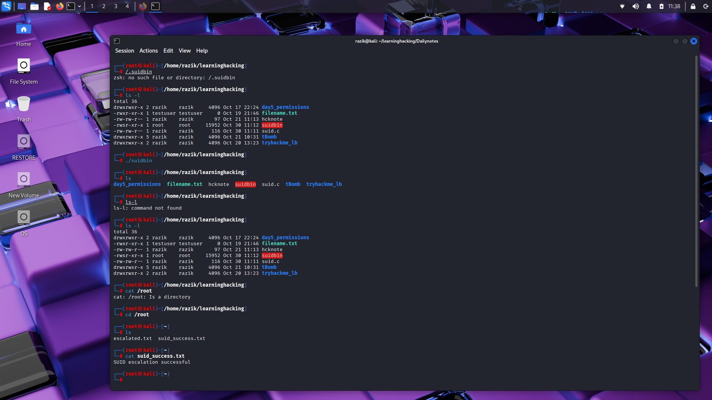

### 🧬 SUID Binary Crafting

- ✅ Created `suid.c` to write to `/root/suid_success.txt`
- ✅ Compiled with `gcc suid.c -o suidbin`
- ✅ Set SUID bit: `chmod 4755 suidbin`
- ✅ Verified root-level file creation
- ✅ Privilege escalation successful

#### 🛡️ Mitigation
- Audit SUID binaries:
  `find / -perm -4000 -type f 2>/dev/null`
- Remove SUID from unnecessary binaries:
  `chmod -s /path/to/binary`
  
### ✅ Proof of Lab Completion

  
